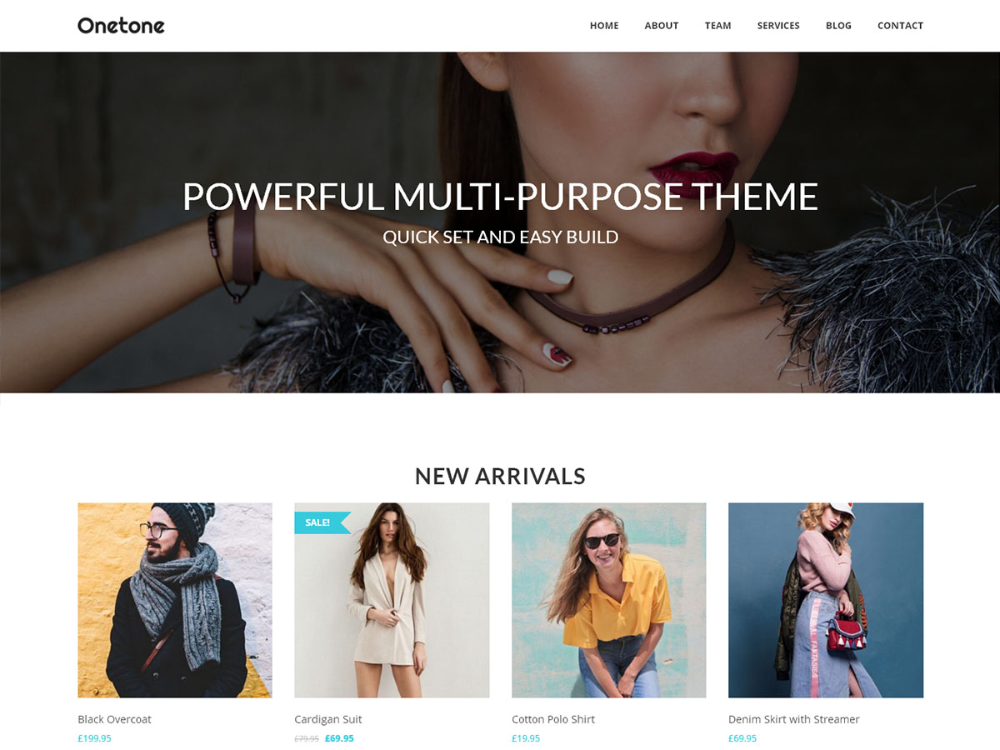
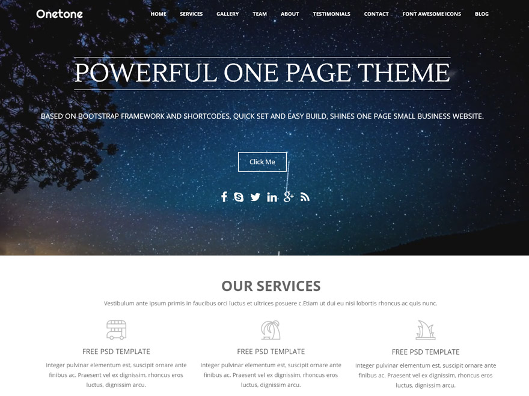

<div align="center">

# OneTone — Security-Patched WordPress Theme

**A responsive, one-page business theme for WordPress — repackaged by [Surefire Studios](https://www.surefirestudios.io) with security fixes for the abandoned upstream release.**

[](https://github.com/SurefireStudios/onetone-wordpress-theme/actions/workflows/php-lint.yml)
[](LICENSE)
[](#-whats-in-this-repository)
[](#-whats-in-this-repository)
[](https://wordpress.org)
[](https://github.com/SurefireStudios/onetone-wordpress-theme/stargazers)

</div>

---

## 🔐 Why this repository exists

The original **OneTone** and **OneTone Pro** themes by [MageeWP](https://mageewp.com/onetone-theme.html) are no longer maintained, and the free theme is no longer listed in the WordPress.org theme directory. Plenty of live sites still run them.

This repository hosts **drop-in replacement builds** that patch known cross-site-scripting (XSS) issues and tighten input handling, so existing OneTone sites can stay online without a full redesign.

> [!IMPORTANT]
> If your site runs OneTone or OneTone Pro from any other source, **update to the builds here**. Always take a full backup before replacing a theme on a production site.

> [!NOTE]
> These are unofficial community patches. Surefire Studios is not affiliated with MageeWP, and the builds are provided as-is under the GPL (see [License](#-license)).

---

## 📦 What's in this repository

| File | Theme folder | Version | Best for |
| --- | --- | --- | --- |
| [`onetone-patched.zip`](onetone-patched.zip) | `onetone` | **4.0.1** | Sites on the free OneTone theme. Customizer-driven, WooCommerce-ready. |
| [`onetone-pro-patched.zip`](onetone-pro-patched.zip) | `onetone-pro` | **3.0.1** | Sites already running OneTone Pro. Adds a dedicated admin options panel and a portfolio. |

Both archives are complete, ready-to-install WordPress themes — unzip straight into `wp-content/themes/`, or upload the `.zip` through the WordPress admin.

> [!WARNING]
> `onetone-pro-patched.zip` originates from a live client build and still registers two site-specific post types (`Team Member` and `Practice Area`). Harmless if unused, but review before deploying to an unrelated site. Stray working files from that build were removed in `3.0.1`.

---

## 🖼 Screenshots

<table>
  <tr>
    <td align="center"><strong>OneTone 4.0.1</strong></td>
    <td align="center"><strong>OneTone Pro 3.0.1</strong></td>
  </tr>
  <tr>
    <td></td>
    <td></td>
  </tr>
</table>

---

## ✨ Features

### Homepage sections

Build the whole front page from the Customizer by picking a template for each section:

| # | Section | # | Section |
| --- | --- | --- | --- |
| 1 | Banner | 9 | Contact |
| 2 | Slogan | 10 | Portfolio |
| 3 | Service | 11 | Pricing |
| 4 | Gallery | 12 | Blog |
| 5 | Team | 13 | Custom |
| 6 | About | 14 | Custom |
| 7 | Counter | 15 | Custom |
| 8 | Testimonial | | |

Plus a full-width **slider** section and **YouTube / Vimeo / HTML5 video backgrounds**.

### Everything else

- 🎨 **Live Customizer options** — colors, typography, spacing and per-section styling powered by [Kirki](https://kirki.org/)
- 📱 **Fully responsive** one-page layout on the Bootstrap 3 grid, with smooth-scroll anchor navigation
- 🌊 **Parallax and video backgrounds**, animated counters, scroll-triggered animations
- 🛒 **WooCommerce ready** — bundled shop templates, product gallery zoom, lightbox and slider support
- 🧩 **Widget areas** for pages, posts, archives, search results and 404 — each with a left and right variant
- 🌍 **Translation-ready** (`.pot` included, with `es_ES`, `fr_FR` and `ru_RU` bundled) and a full **RTL stylesheet**
- ⭐ **Font Awesome 4.7** icon picker throughout the section options
- 🖼 Custom background, custom header, custom logo and favicon, post formats and featured images
- ⚙️ Custom CSS field, editor styles, Jetpack support and WPML config

### OneTone Pro adds

- A standalone **theme options panel** in the admin (Options Framework) alongside the Customizer
- **Portfolio** post type with single, category-taxonomy and grid templates
- Extra **WooCommerce sidebars** for shop archives and product pages
- **WPBakery / Visual Composer** element templates

---

## 🧰 Tech stack

| Layer | Used |
| --- | --- |
| Platform | WordPress (classic PHP theme, no build step) |
| Language | PHP, HTML5, CSS3, JavaScript (jQuery) |
| CSS framework | Bootstrap 3.3.7 (3.3.4 in Pro) |
| Options | Kirki Customizer framework (free) · Options Framework (Pro) |
| Icons | Font Awesome 4.7.0 |
| JS libraries | Owl Carousel, Magnific Popup, Waypoints, CounterUp, Parallax.js, YTPlayer, ScrollTo, jQuery Nav |
| Commerce | WooCommerce template overrides |
| Plugin bootstrap | TGM Plugin Activation (prompts for *OneTone Companion*) |

---

## 🚀 Installation

### Requirements

- WordPress **4.0 or newer** (tested up to 5.8)
- PHP **7.4 – 8.3** (both archives are syntax-checked against 7.4 and 8.3 on every push)
- *Optional:* [WooCommerce](https://wordpress.org/plugins/woocommerce/) for shop pages

### Option A — WordPress admin (recommended)

1. Download [`onetone-patched.zip`](onetone-patched.zip) (or [`onetone-pro-patched.zip`](onetone-pro-patched.zip)) from this repository.
2. In WordPress, go to **Appearance → Themes → Add New → Upload Theme**.
3. Choose the `.zip`, click **Install Now**, then **Activate**.

Replacing an existing OneTone install? Back up the site first, then upload the zip and confirm the **Replace current with uploaded** prompt. Theme options live in the database, so your settings are preserved.

### Option B — Manual / SFTP

```bash
cd wp-content/themes && unzip ~/Downloads/onetone-patched.zip
```

That creates `wp-content/themes/onetone`. Activate it under **Appearance → Themes**.

### Option C — WP-CLI

```bash
wp theme install https://github.com/SurefireStudios/onetone-wordpress-theme/raw/main/onetone-patched.zip --activate
```

Add `--force` to overwrite an older OneTone install in place.

---

## ⚙️ Usage & configuration

1. **Create a front page.** Add a page, assign the **Home** page template (`template-home.php`), then set it under **Settings → Reading → Your homepage displays → A static page**.
2. **Build the sections.** Open **Appearance → Customize**. Each homepage section has its own panel where you choose a section template (Banner, Service, Team, …), add content, and set its background, padding, colors and typography.
3. **Wire up the menu.** Give a section a *Menu Title* and OneTone adds it to the one-page anchor navigation with smooth scrolling.
4. **Style globally.** Site-wide colors, fonts, header behaviour (sticky / overlay), footer and social icons live in the Customizer's global panels. Free-form tweaks go in the **Custom CSS** field.
5. **OneTone Pro.** The same options are also available from the dedicated **OneTone** options panel in the admin sidebar, plus portfolio and WooCommerce settings.

> [!TIP]
> The free theme prompts you to install **OneTone Companion**, the upstream plugin that supplied the contact form and one-click demo templates. It is optional — the theme works without it, but the contact-form section needs it.

---

## 📝 Changelog

### OneTone `4.0.1` · OneTone Pro `3.0.1` — 2026

**PHP 8 compatibility**

- Fixed a fatal parse error in `onetone-pro/functions.php`, where the file ended inside an unterminated `/**` comment block. On PHP 8 this stopped **OneTone Pro from loading at all**.
- Fixed an unparenthesized nested ternary in `woocommerce/config.php` in both themes — fatal on PHP 8.0+ whenever WooCommerce loaded that file.

**Housekeeping**

- Removed files left behind by a site build in the Pro archive: `error_log` (two copies), `functions.php0`, `style.css.1`, `merged-style.css` and `optimisationio-merged-script.js`. These were unreferenced by the theme and leaked the originating server path — about 1.9 MB in total.
- Added a CI workflow that syntax-checks every PHP file in both archives on PHP 7.4 and 8.3.

### OneTone `4.0.0` · OneTone Pro `3.0.0` — 2025

**Security**

- Added critical security patches to address XSS vulnerabilities
- Enhanced overall theme security
- Improved input validation and sanitization

For releases before the Surefire Studios fork, see `readme.txt` (OneTone) and `ChangeLog.txt` (OneTone Pro) inside each archive, or the [original theme documentation](https://mageewp.com/onetone-theme.html).

<details>
<summary>Original upstream theme header (OneTone Pro)</summary>

```
Theme Name: Onetone Pro
Theme URI: http://www.mageewp.com/onetone-theme.html

Description: Onetone Pro is a one-page business theme based on Bootstrap framework and
coded with HTML5/CSS3. All required information are displayed on a single page with clear
order according to users' preferences. The basic sections designed for business purpose
have already been built for you, such as services, about, gallery, clients, etc. There's
also an extensive admin panel where unlimited sections can be easily added. Multiple
options are available if you prefer to do some adjustments, such as changing background,
parallax scrolling background, video background, Font Awesome Icons, uploading logo and
favicon, adding custom CSS and so on. The theme is also responsive, clean, and SEO
optimized. This version has been security patched by SureFire Studios to address critical
vulnerabilities.
```

</details>

---

## ⚠️ Known limitations

- **`Tested up to: 5.8`.** Neither theme has been verified against a current WordPress release. Testing reports are welcome.
- **Dated dependencies.** Bootstrap 3 and Font Awesome 4 are both end-of-life upstream. They still work, but no longer receive fixes.
- **The Pro archive** carries two post types from the client site it was built for — see the note under [What's in this repository](#-whats-in-this-repository).

CI verifies that every PHP file parses on 7.4 and 8.3; it does not exercise the themes at
runtime. Please test on a staging site before deploying.

---

## 🤝 Contributing

Issues and pull requests are welcome — especially further security hardening, PHP 8 compatibility fixes and WordPress version testing reports.

Because the themes ship as archives, a code change means extract → edit → lint → repackage. **[CONTRIBUTING.md](CONTRIBUTING.md)** walks through it, including how to rebuild a `.zip` that WordPress will accept.

Every push and pull request is syntax-checked by the [PHP Lint workflow](.github/workflows/php-lint.yml) across PHP 7.4 and 8.3.

> [!CAUTION]
> Found a security vulnerability? **Don't open a public issue** — follow [SECURITY.md](SECURITY.md) to report it privately.

---

## 📄 License

Released under the **GNU General Public License v3.0** — see [LICENSE](LICENSE).

OneTone and OneTone Pro were originally created by [MageeWP](https://mageewp.com) and released under the GNU GPL. These builds are derivative works distributed under the same terms. Security patches by [Surefire Studios](https://www.surefirestudios.io).

Bundled third-party libraries keep their own licenses (Bootstrap — MIT, Font Awesome — SIL OFL 1.1 / MIT, Kirki — MIT, and others noted inside each archive).

---

## 🔗 Links

- 🌐 **Surefire Studios** — <https://www.surefirestudios.io>
- 📘 **Original theme (MageeWP)** — <https://mageewp.com/onetone-theme.html>
- 🐛 **Report an issue** — <https://github.com/SurefireStudios/onetone-wordpress-theme/issues>

<div align="center">
<sub>Maintained by <a href="https://www.surefirestudios.io">Surefire Studios</a> · Keeping legacy WordPress sites safe.</sub>
</div>
